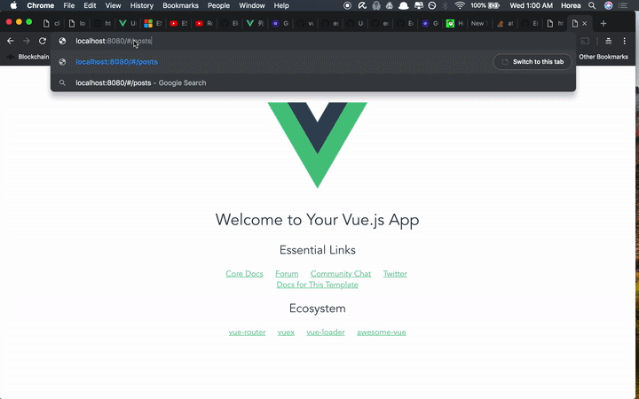

# myPosts


A Vue.js app that consumes posts from an API and then displays those posts, and lets the user filter the posts by finding even or odd IDs.
  

# Getting Started
To run this app, go ahead and clone this project
by running 

```$ git clone https://github.com/southernspice/Posts.git```

and then go into the newly created directory with this command:

```$ cd Posts```

Next, we need to install all of our dependencies.

```$ npm install```

Let's go ahead and run our server-side test, to make sure our 
connection is working properly:

```$ npm test ```

If all goes well, you should see that both your tests pass:

```    ✓ responds to /posts (522ms)
::ffff:127.0.0.1 - - [07/Nov/2018:17:45:47 +0000] "GET / HTTP/1.1" 200 11 "-" "node-superagent/3.8.3"
    ✓ responds to /


  2 passing (776ms)
```

We can go ahead and start our server now, with the following command:

```$ npm start```

Next, we have to build our client-side app. Go ahead and go into the 
client app, and install dependencies with the following command:

```
$ cd client
$ npm install
```

Once the dependencies are finished installing, go ahead and run the client
app with the following command:

```$ npm run dev```

# Running the app

Once the project is done building, you can go ahead and go to
`localhost:8080` to see the home page of the app. It's just the
Vue.js boilerplate, nothing to see there.


Go ahead and go to `localhost:8080/#/posts` to see our app.
If you go there, the app should make a call to the jsonplaceholder API
and retrieve 100 posts. There are buttons on the top to filter the 
posts - either by evenID or oddID. Go ahead and play with those buttons -
once you are done, you can click on `getAllPosts` to get back to the 
original 100 posts.
